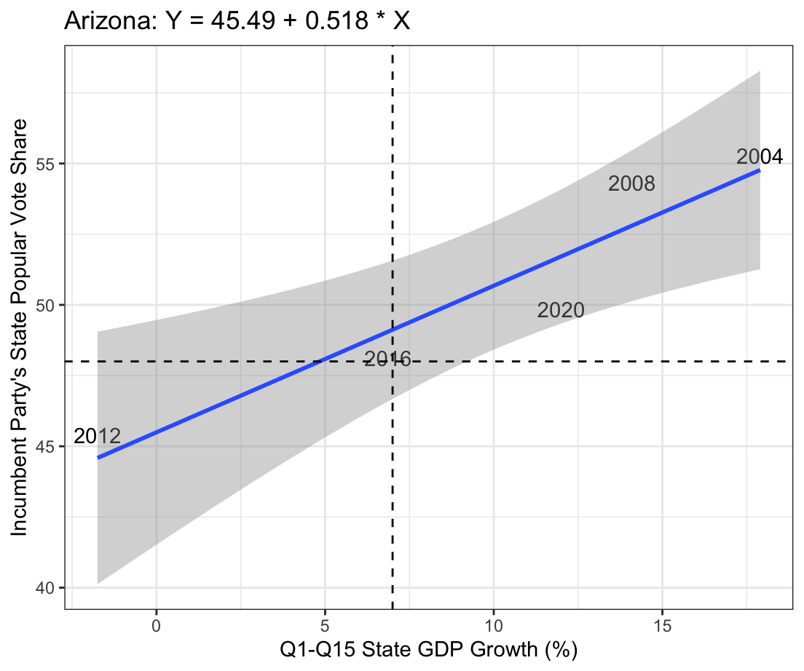
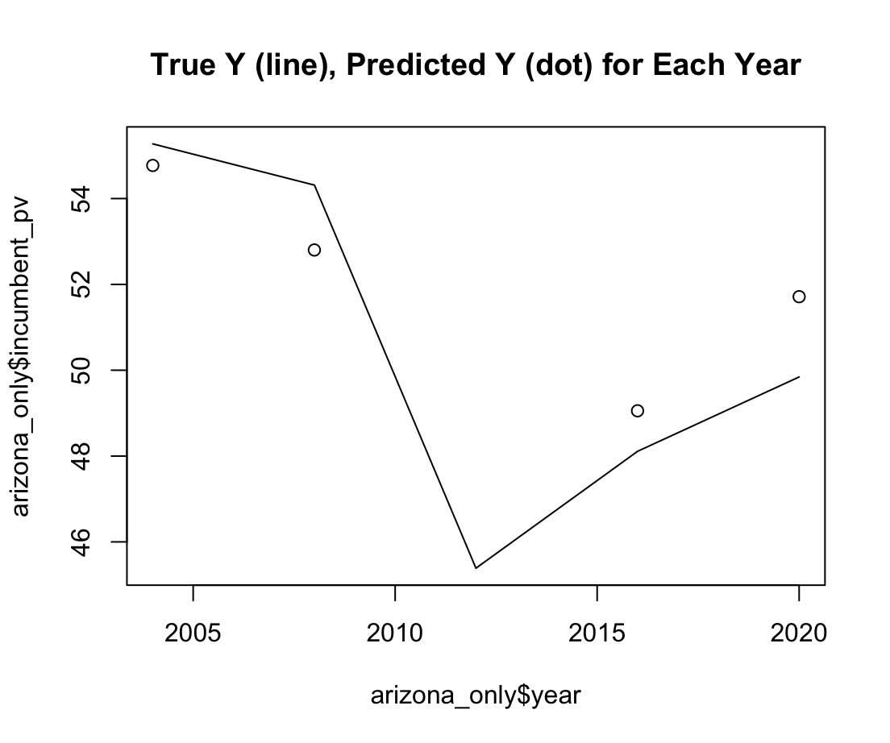
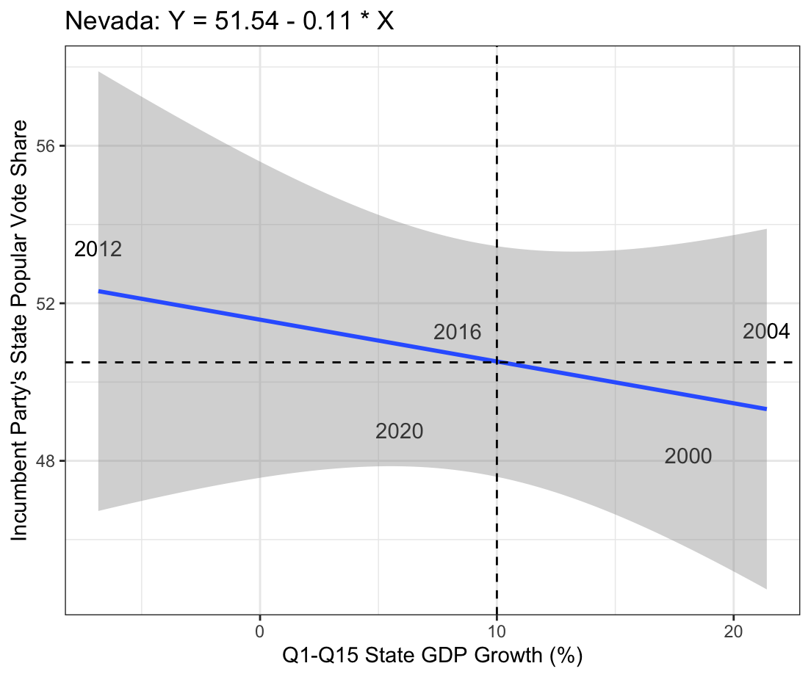

# Introduction 

This blog entry analyzes if we can predict election outcomes using only the state of the economy. Specifically, I chose to look at swing states and their individual change in GDP in order to examine if we can predict their votes using their economies. This is of particular interest to me because in 2020 and 2022, I worked for a PAC that targeted swing states during the presidential and congressional elections. Many a day was spent knocking on doors, helping the elderly find their nearest voting station, and occasionally, getting chased away by slobbering dogs. The PAC – along with other reputable sources[^1] – carved out these five swing states as having the greatest influence on election outcomes: Arizona, Georgia, Nevada, North Carolina, and Pennsylvania. The same continues to hold true as we enter the 60th quadrennial election[^2].

To begin my analysis, I I needed to collect data on state GDP for the past few years. Unfortunately, the data I could find on the BEA website[^3] was limited to years post-1997 due to a shift in how they collected data, changing from SIC industry definitions to NAICS industry definitions[^4]. Therefore the presidential elections that I have included in my data analysis are the following: 2000, 2004, 2008, 2012, 2016, and 2020. I measured change in GDP over the full presidential term, such that it was reported in a percentage difference between, for example, 2004 and 2000. For the year 2000, I had to make do with a year less of data and found the GDP growth between 1997 and 2000. 

Next, I scraped popular vote data for my swing states from the “clean_wide_state_2pv_1948_2020” data set. For each year that I looked at, I indicated who the incumbent party in national office was and made a column in my data frame for the percentage of the popular vote in the state that went to that incumbent party. This was naturally my dependent variable that I wished to predict. Accordingly, the change in state GDP over the presidential term was my independent variable. 

## Arizona

When I first plotted Arizona as a bivariate scatterplot, I noticed that 2000 was a major outlier. I thought that perhaps it was an outlier because the growth in state GDP was only measured from the past 3 years before the 2000 election, not the past 4. I excluded it from my analysis of Arizona for that reason – please be aware of that! Visually, we can tell (without 2000) that there is strong positive bivariate correlation.

Including 2000, the correlation between the two variables is 0.3914266. Without it, the correlation is 0.9440552. It seems almost too good to be true. Using the linear regression model, Y = 45.49 + 0.518 * X, we find that the R^2 is also incredibly high, at 0.8912402. 

Using in sample testing, we make a graph of the true outcome (the line) against the predicted outcome using our model (the dots) and find that there is small variance. 

Finally, using “leave one out” testing, the error was 1.87035, which again is not too shabby. 

## Nevada

Feeling quite confident in my new findings, I ventured into Nevada, only to find that when I plotted that model, things started to look weird. 

The correlation between our two variables in Nevada is -0.3153867. Again, there appears to be an outlier for the year 2008. Measuring state GDP in this year is tricky because of the financial crisis, which had an impact on the election[^5]. For the sake of the experiment, I looked at the correlation without 2008: -0.55361158. Better than -0.32! 

The linear model that corresponds with Nevada’s data (excluding 2008) is Y = 51.54 - 0.11 * X with an R^2 of 0.3065. This feels low to me compared with our R^2 for Arizona. 

## North Carolina, Pennsylvania, Georgia

North Carolina and Pennsylvania’s models failed me completely with an R^2 of 0.02 and 0.05 respectively. Georgia too, with an R^2 of 0.06. 

## Conclusion and Further Analysis

For some reason the only model that really worked was Arizona! There are two ways I approached my findings: 

1) This tells me that voters in the swing states of North Carolina, Pennsylvania, and Georgia are more likely to be sociotropic voters than pocketbook voters. Meaning? They are less likely to worry about their state GDP and more likely to vote along the lines of the national GDP when voting in the presidential election. 

2) I do firmly believe that – given the success with Arizona’s model and the fair success with Nevada’s model – with more presidential election and state GDP data points, I could improve my models for Arizona and Nevada. Even being able to accurately predict the outcome of Arizona’s votes is impactful – Biden barely scraped those electoral college votes in 2020[^6]. 

Finally, I should have been even more parsimonious with my data collection. Instead of analyzing real GDP data, I could have used the chain-type quantity index for real GDP, which measures output at constantly updated prices, adjusting for inflation. This would have likely been more accurate for long-term comparisons and accounted for the outliers in 2000 and 2008. 

[^1]: https://www.axios.com/2024/05/06/biden-trump-election-swing-states
[^2]: https://www.washingtonpost.com/politics/2024/08/30/key-swing-states-2024-presidential-election/
[^3]: https://www.bea.gov/data/gdp/gdp-state
[^4]: https://www.bea.gov/cautionary-note-about-annual-gdp-state-discontinuity
[^5]: https://www.npr.org/2009/09/08/112651600/financial-crisis-gave-candidate-obama-a-boost
[^6]: https://www.usnews.com/news/elections/articles/the-2024-swing-states-arizona-could-sway-the-2024-election