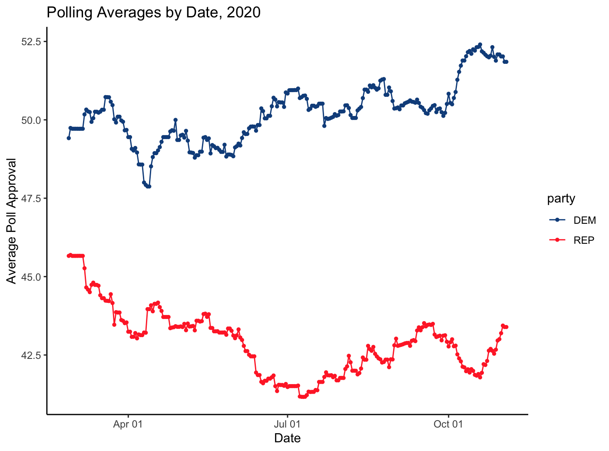
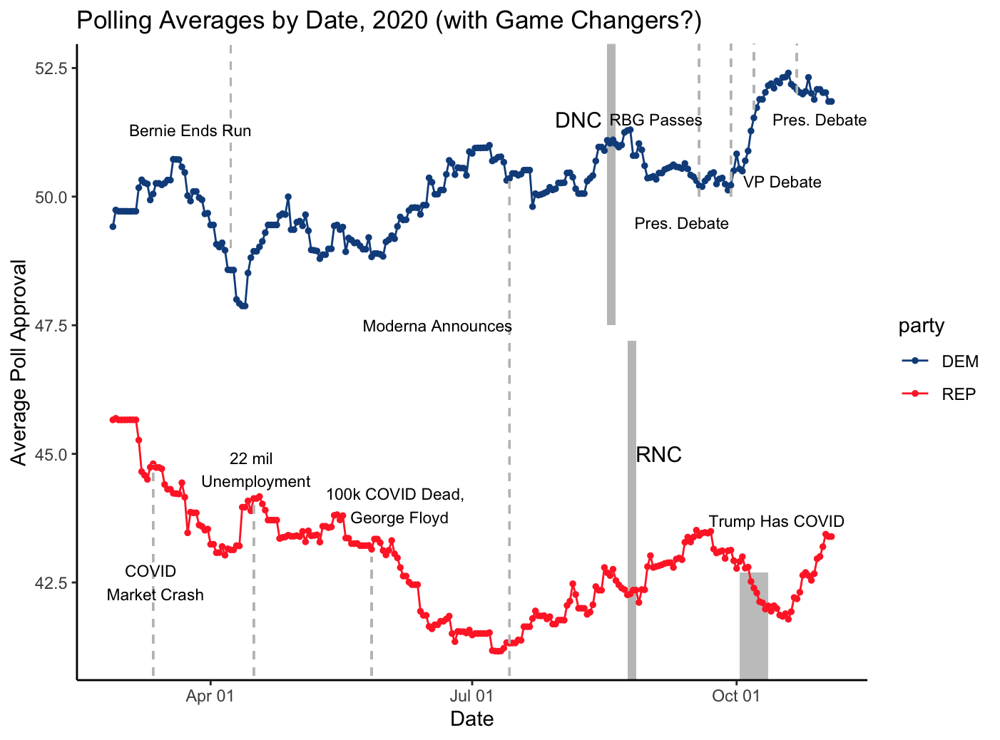
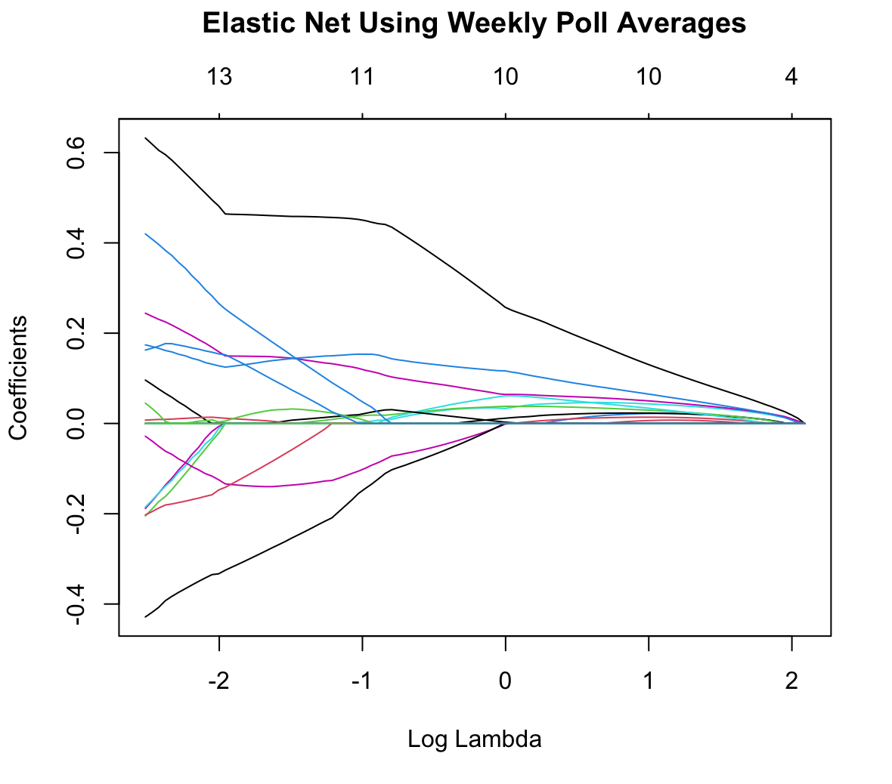

# Introduction

In this week’s blog post, we will attempt to explore how we can best use polls to prejudice election outcomes. To do this, we will first start by predicting the outcome of this year’s election using weekly poll averages. From there, an ensemble model will be made with weighted variables. 

As our favorite nepo baby Alexis de Tocqueville said on the 1832 US Presidential Election, “a thousand voices are heard at once, each expressing some social requirements.” Each election after has only gotten larger, with the voting population expanding and changing as immigrant and electoral laws do[^1]. However, it is not necessarily true that polls are representative of these thousand voices. Whenever humans are involved, there’s bound to be some human error…

Polling can be deceptive! Without looking at any other factors, this might seem like a straightforward graph.

But then you add in game changer events, which complicates things. 

## Weekly Poll Averages

When predicting national popular vote, we run into the “curse of dimensionality” where p > n. Essentially, the possibility of overfitting grows and we increase the out-of-sample prediction error, which is precisely what we are hoping to keep close to 0. The smaller the subset of features in our model, the stronger the effect. 

In this case, we can constrain our coefficients to reduce variance. This way, coefficients can only increase if they decrease the sum of square residuals. 

The Elastic-Net Regression is a linear combination of both the Ridge and LASSO penalties. If this makes absolutely zero sense to you, check out this informational article[^2] and GO TO SCHOOL!!! (Unless education is not as accessible to you, which in that case, I’d say Please take advantage of ChatGPT and continue voting for public education funding.)

I am using the Elastic-Net Regression because it feels like a safe middle ground. If we run it on weekly poll averages over the last elections, we see that each colored line represents the path of a specific predictor variable’s coefficient as lambda changes. In this case, the predictor variables are the number of weeks left until the election. Clearly, not all of them have the same level of influence, which makes sense empirically, given that a poll taken the week before the election probably has more relevance. 

We can use this regression to predict the two-party popular vote share outcome for this year, which gives us that Harris will win BARELY at 51.8% and Trump at 50.7%. We can only hope… OR we can run an ensemble model to verify our claims.

## Ensemble Model

Combining different predictions, we can construct a “meta-model” or “ensemble model” that is more accurate. I like using the term “ensemble model” because it reminds me of ensemble casts, which turns statistics and data science into a fun Wes Anderson movie set in Europe. 

There are two ways to go about doing this: 1) unweighted and 2) weighted. An unweighted model would give equal credence to all variables. For example, PollyVote’s 2020 model used equally weighted polls, expectations, models, and naive forecasts[^3]. Ultimately, this means taking the average predictions from different models. As of August 21, 2020, they predicted that Joe Biden would gain 52.1% of the popular vote over Trump[^4]. In reality, Biden DID win with ​​51.3% of the popular vote. 

The dataset of fundamentals that I used while making these models includes: GDP, GDP quarterly growth, Real Disposable Personal Income (RDPI), RDPI quarterly growth, Consumer Price Index (CPI), unemployment rates, the SP500 and incumbency along the lines of GDP growth, CPI, SP500 index and unemployment.

I combined these fundamental variables with the weekly poll data from earlier to build an unweighted ensemble model. Using this, we predict that Harris will win at 51.51% of two-party popular vote share and Trump at 49.15%. 

On the other hand, we can weigh our ensemble cast by assigning weights to different models based on performance. For example, we can weigh on days until the election, on R^2, on cross-validation error, or on human priors. If you want to be fancy about it, you can combine fundamentals and polls using Bayes’ Rule[^5]. 

538 says that in their system of weighted modeling using both polls and fundamentals, “[w]hen we have few polls or when it's early in the campaign, our model's predictions are mostly based on the fundamentals — with their standard deviation usually around 6 points or so”[^6]. This fits with Nate Silver’s method of weighing variables. If we run this ensemble model, we get that Harris wins at 51.71% of the two-party popular vote share and Trump at 50.22%. 

## Pollster Quality

If we want to get even more accurate however, it could be wise to take a look at pollster quality. Not all polls are made equal, just like not all Harvard houses are (sorry Eliot!). 

FiveThirtyEight gives us their pollster ratings for 2016, 2020, and 2024. Using this data, we can build another model that uses those individual polls and their measured vote shares. The 2016 polling data has a grading range from A+ to D and a poll weight from 8.72 to 0. For 2020, there are no public poll weight data but there is a grading system that ranges from A+ to F. For 2024, the opposite is true – no letter grading, but there is a numerical grade that stretches from 0.5 to 3. 

Confusingly, sometimes an A+ poll will have a lower poll weight or lower numerical grade. For this reason, I chose to follow the 2024 system and regrade the 2016 and 2020 polls by their letter grade so that they are now assigned a numerical grade between 0 and 3. In 2016, any poll with the grading of D now has a poll weight of 0.3. In 2020, any poll with the grading of F now has a poll weight of 0.23. 

I ended up having to re-regularize the polling weight to be between 0 and 1 so that I could cleanly multiply them by their popular vote counts. 

After fitting e-net regression on this, I tried to use it to predict a vote count for 2024. It was very difficult! Eventually the number I got was that Harris would win at 52.31% of the popular vote share, but (with more time) I would want to run it again.

[^1]: https://centerforpolitics.org/crystalball/the-transformation-of-the-american-electorate/ 
[^2]: https://corporatefinanceinstitute.com/resources/data-science/elastic-net/#:~:text=What%20is%20Elastic%20Net%3F,the%20regularization%20of%20statistical%20models. 
[^3]: https://www.cambridge.org/core/journals/ps-political-science-and-politics/article/abs/pollyvote-popular-vote-forecast-for-the-2020-us-presidential-election/E93EB09F1858C2E7B10D56B549F3C0F2 
[^4]: Ibid
[^5]: https://votamatic.org/wp-content/uploads/2015/08/2015LauderdaleLinzerIJF.pdf 
[^6]: https://abcnews.go.com/538/538s-2024-presidential-election-forecast-works/story?id=110867585 
