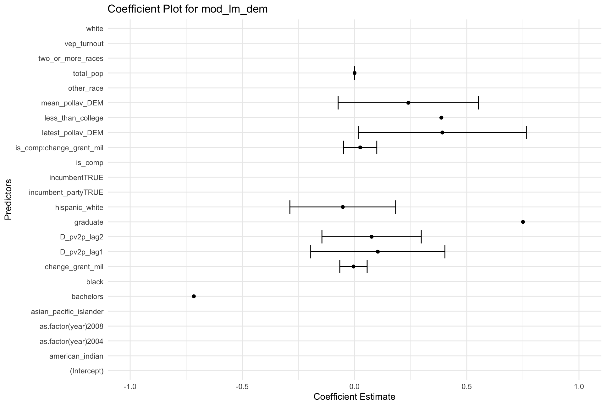

# Introduction

In this week’s blog post, we will be exploring how campaigns can use demographic information to get their people elected. Specifically, what are the connections between demographics and voter turnout? Can demographics and turnout be used to predict election outcomes? Or are campaigns wasting their time and money on securing the “Gen-Z-latinx-high-school educated-gay” vote? 

In Shaw & Petrocik’s 2020 research[^1], they showed that whites, college-educated, and older voters tend to have higher turnout rates. There are intuitive reasons for all of these cases (mainly around having the time and money to go and vote), but in the past few years, things may have changed as America’s demographics do too. 

## Bias Thesis

The Bias Thesis claims that an increase in turnout increases the vote share for Democrats generally, but research shows that the turnout rate does not consistently help any party. Obviously, an incredibly unbalanced turnout between the two party has impact. Apart from that, however, turnout has minimal effect for campaigns. 

## Kim & Zilinsky (2023)

In further debunking news, Kim & Zilinsky’s 2023 research concludes that demographics reveal very little about voting and partisanship. We can use basic demographic variables (age, gender, race, income, education) to analyze partisanship and vote choice. With our ANES dataset, we can attempt to replicate Kim & Z’s model. 

First, with logistic regression, we find that the in-sample goodness-of-fit displays race, gender, and education as the most influential coefficient (which tracks with what Shaw & P found). Our out-of-sample accuracy is 67.34%; we correctly predict “Democrat” for 746 of the sample’s vote choice.

Next, using Random Forests, we find that the in-sample accuracy is 70.31% and out-of-sample is 70.25%. 

## Simulations

The model that we are running for the simulated electoral college votes is “mod_lm_dem”. I’ve graphed the predicted values against the actual values in the following plot. 

We can simulate voter turnout in 2024 to predict the electoral college vote share for this year. To make things easier, I first made predictions using simple average turnout from each state. 

(Note that the blank spaces on the map are states that we don’t have data on yet.)

To test the accuracy of this model, I ran the same simulation but on 2020’s presidential election (which we already have the results for!). Again, using simple average turnout from each state and pretending like we don’t know what 2020’s voter turnout and voter demographics are going to be, we get the following electoral college results. 

When compared with the actual 2020 results[^2], we see that the predicted electoral college votes are accurate EXCEPT for Georgia, Florida, and North Carolina, which are three swing states in this year’s election. This model even predicted accurately the states that flipped (PA, MI, WI, and AZ). It looks like voter demographics and turnout actually DO matter a little bit in these battleground states, especially as the presidential elections become tighter and tighter. 

## (Newer) Pooled Model

I incorporated the pork spending data from Kriner & Reeves that categorize federal grants by state. I then re-ran the pork state model from Week 4 and merged that dataset with our newer demographics data. After training this new data and incorporating the change in grant money per year as a variable, I simulated for 2024. The results, however, were surprising to me, because this model predicted the same electoral outcomes as previously, with Democrats winning 14 states and Republicans winning 5. 

It looks like in this model, the spending of pork is an incredibly small coefficient. 

Next week, I’d like to drill down on the best way to combine demographics and turnout with fundamentals to accurately predict electoral college votes. In specific, I will be looking at how to weigh pork spending accurately to predict swing state votes. 

[^1]: https://academic.oup.com/book/32439 
[^2]: https://www.cnn.com/election/2020/results/president 
