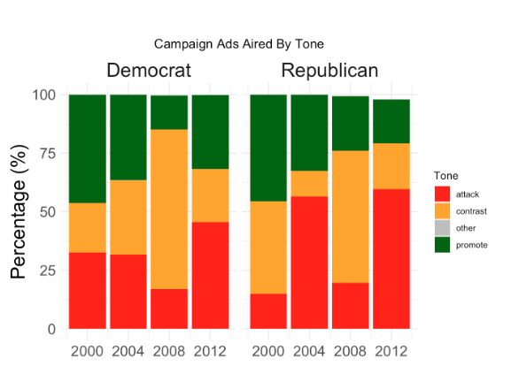
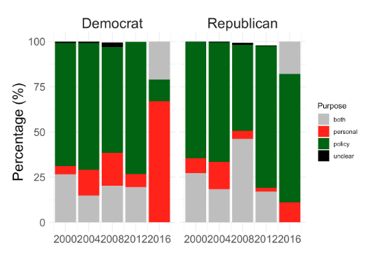
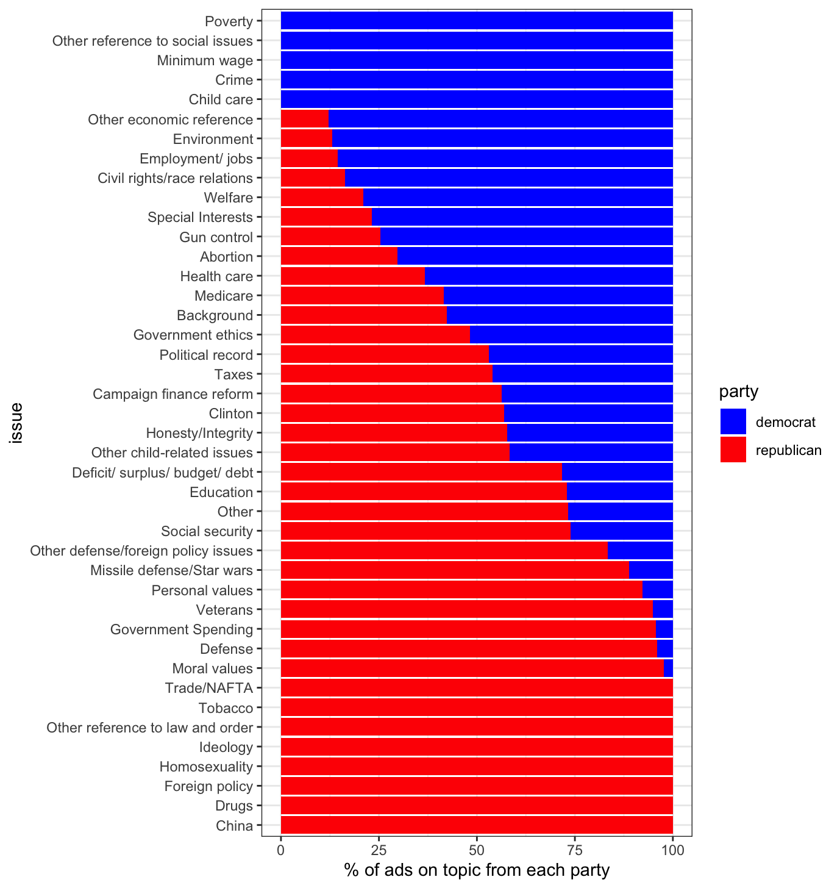
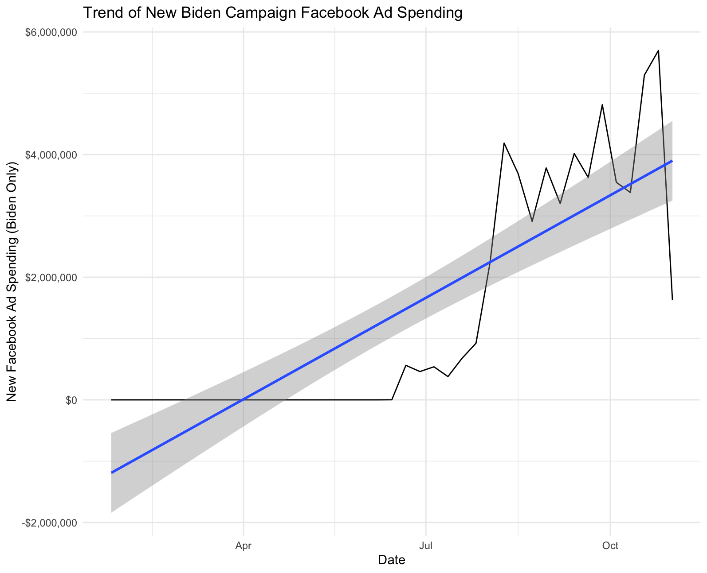
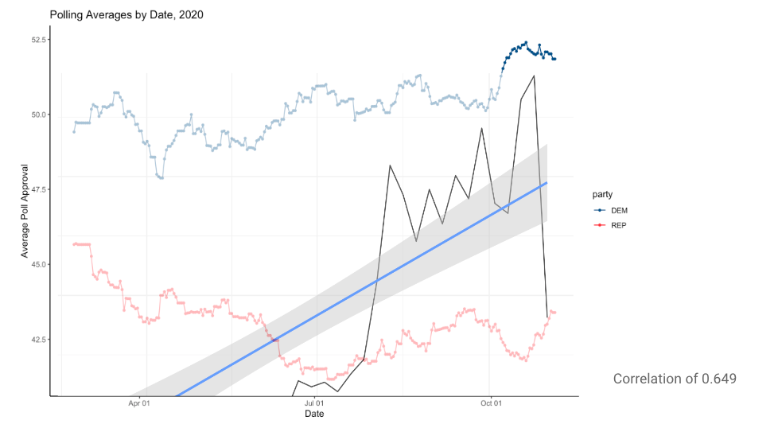
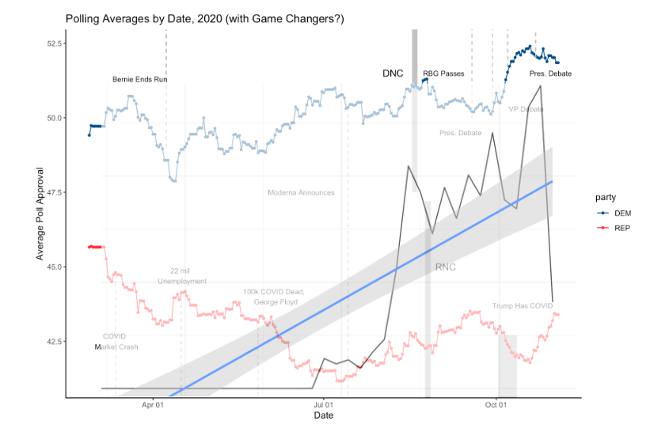

PSA to all my dedicated readers, of whom I believe there may only be one (thanks Matthew)-- I was traveling this weekend and forgot to push this to Github until late Monday night. Sorry!

# Introduction

The USA is the largest presidential democracy in the world. We pay attention the national election like nothing else exists. In 2020, the US spent 6.6 billion dollars on the election. 

There are three basic reasons why a candidate might spend money on ads. 1) To convince donors to give money, 2) to persuade voters to vote for you, and 3) mobilize supporters to turn out and actually cast their votes. This is the so-called “air war,” where mass media is used to get the vote.

## Do campaigns actually matter? 

Despite all the money that is spent, we can forecast models ignoring the campaign and they’re pretty darn accurate. This might happen for a few reasons, especially nowadays, because if we don’t like something – aka a Trump ad or a pro-life Instagram post – we can just block, report, and mute or even avoid politics altogether. 

That being said, campaigns inform citizens and help them discover their true preferences. They play an important role by allowing citizens to make those informed decisions. The polls become more accurate over time because of campaigns. 

## Ad Spend 

Overall, Democrats and Republicans both put out a good variety of ads. The most common are contrast and attack ads. 

Additionally, most of these ads are about policy. The one exception is during the 2016 election when Democrats made more personal ads about Donald Trump. 

Finally, we find that Democrats run a lot of ads on poverty and child care, while Republicans love talking about foreign policy and drugs. 

## Social Media

In 2020, the Biden campaign spent almost 6 million dollars in ads on Facebook. And over time, they sunk more and more money into the platform’s ads. This makes sense – a campaign wouldn’t waste their money trying to convince uninterested voters at the start of a presidential run. We live in an attention economy and there is more money to be made (and votes to be had) towards the actual election, when citizens have their noses to the ground. 

We can overlay this graph with the graph of polling averages to see if it impacted those. Overall, there seems to be a pretty positive correlation (~0.649) between average poll approval and ad spend here, with support for Biden increasing as ad spend increases. 

HOWEVER, there could be multiple factors in this presidential election. For example, the DNC was a game changer “spike” for Biden’s campaign and also happens to be around when ad spend for the campaign spiked as well. 

## Does the coconut fall far from the tree?

Harris is entering the presidential election at a really weird time. TikTok is now a political minefield and, as we saw with January 6, Facebook is a strong rallying force for political radicals and extremists [^1]. Not to mention Harris doing the unthinkable and doing a podcast episode with the Queen of Gen-Z Women [^2]. 

The Democrats are spending on political ads online on all Meta channels (aka Facebook and Instagram), while Republicans are pushing strong on X [^3]. 

My opinion is that this year’s election will only further calcification[^4] BECAUSE of social media. With Instagram, X, Facebook, and TikTok being political echo chambers with algorithms that play up to your own political preferences, I believe that the most important factors going into my forecasting model will be 1) party ID and 2) economic fundamentals. 

[^1]: https://www.washingtonpost.com/technology/2021/10/22/jan-6-capitol-riot-facebook/
[^2]: https://www.axios.com/2024/10/13/trump-harris-podcasts-call-her-daddy 
[^3]: https://www.washingtonpost.com/technology/2024/10/07/musk-trump-x-ads/ 
[^4]: https://newsroom.ucla.edu/stories/q-a-lynn-vavreck-biden-trump-americas-political-divide 

