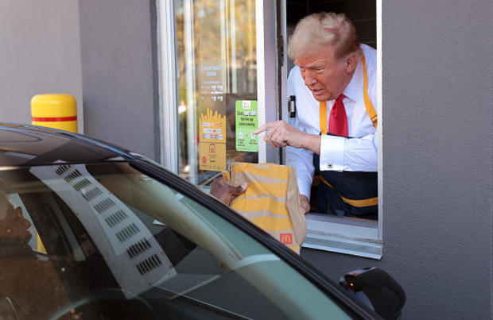

# Introduction

Last week, we talked about ads and their role in presidential campaigns. This week, we’ll be analyzing the ground game. This includes (but is not limited to): door-knocking, calling voters, sending texts, and working at McDonald’s in Lancaster, PA[^1]. 

Most campaign spending comes from mass media ads, but it is my humble opinion (as a former pro canvasser[^2]) that the ground game is actually more important than people give it credit, especially in swing states.

## Field Offices

To nail down specific features of the ground game, we can take a look at the differences in field office placement and whether they increase voter turnout and/or the vote share for Democrats. 

In 2012, we saw that Obama built more field offices in swing states than Romney, perhaps leading to his victory. Our data shows a slight increase in turnout and the Democratic vote share in states with more field offices. 

Using data from the 2012 and 2016 Democratic campaigns, we can plot the locations of field offices onto a map of Wisconsin counties to try and analyze any relation between their quantity and the win margin. 

As you can see in the map, the Obama campaign had more field offices in Wisconsin than Clinton in 2016, securing their electoral votes for victory. Where the field offices are more strongly clustered, the counties are “bluer,” meaning the win margin for Obama was higher. The same can be said for Clinton’s 2016 map, although with a more negative connotation. Her lack of field offices in the northern parts of Wisconsin led to a widespread shift to Republican wins in those counties. This was interesting to me because Obama won Wisconsin in 2008, but still pushed for a larger number of field offices in the state, while Clinton assumed (incorrectly) that Wisconsin would be a safe win. 

This year, I attempted to collect data on the differences between Harris and Trump’s field office strategies, specifically in swing states. Harris’ battleground states director claims that – as of August 3, 2024 – Harris had 13 offices in Nevada, 24 offices in Georgia, and 36 offices in Pennsylvania[^3]. On July 12, NPR had reported that the Trump campaign opened over 12 offices in Georgia[^4]. Following up on this data, The Nevada Independent reported on August 27 that the Harris campaign had 14 offices in Nevada, while Trump only had 5[^5]. By August 30, it was reported that the Harris campaign increased their number of field offices to 50 in Pennsylvania[^6]. It is obvious that the Trump campaign is concentrating their efforts onto strategies other than field offices in swing states, although they are now starting to push for more Trump Task Forces to pop up in areas. 

Outside of these field offices, however, it would be erroneous not to mention the numerous super PACs and outside organizations that are stumping at the same time. For example, America PAC, a super PAC affiliated with Elon Musk, is sending people door-to-door as well. It appears the Trump campaign is taking advantage of a FEC decision that allows campaigns and PACs to coordinate on canvassing operations[^7]. I suspect this has to do with the relatively low numbers of Trump field offices in the mentioned swing states. 

Because of this, I doubt that the presence of field offices will make or break this election. 

## Binomial Simulation

Finally, before closing out this blog post, I do want to talk about this new-fangled thing I discovered called probabilistic models. A problem that we have been running into with our forecasting models has been that the bounds of Y sometimes exceed the true values of our variables. 

In this hypothetical poll support graph of the different states, we see that there are no polls in some states (empty boxes), very high variance (see NV), negative slopes (see MS), or simply Y not being in the 0-100 range. This is the problem with linear regression. 

Instead we can take and simulate voters using binomial logistic regression, such that the election outcome for Democrats is a finite draw of voters from the voting-eligible population turning out to vote Democrat. Basically, it’s the predicted probability of a draw. 

To do this, we estimate the parameters of a probabilistic model and obtain distributions from repeated simulations of the probabilistic process.

Here, we simulate the distribution of election results in Pennsylvania, using a general additive model (GAM) to impute the voting-eligible population in Pennsylvania for 2024 using historical numbers. 

We can take the weighted average of linear and GAM predictions to land on our final prediction of the voting-eligible population that turns out in 2024 in Pennsylvania: 10,044,706. 

Moving forward, we can incorporate this voter turnout simulation into our forecasting models. 

[^1]: https://www.cbsnews.com/philadelphia/news/donald-trump-town-hall-lancaster-kamala-harris-pennsylvania/ 
[^2]: https://www.teenvogue.com/story/joe-biden-wins-arizona-blue 
[^3]: https://www.reuters.com/world/us/harris-campaign-staffs-up-battleground-states-sun-belt-play-2024-08-03/
[^4]: https://www.npr.org/2024/07/12/nx-s1-5032965/trump-force-47-maga-organizing-georgia-arizona 
[^5]: https://thenevadaindependent.com/article/as-race-narrows-trump-campaign-ramps-up-in-nevada 
[^6]: https://www.pennlive.com/news/2024/08/harris-campaign-opening-50th-pa-office-aiming-to-cut-trumps-advantage-in-rural-red-counties.html 
[^7]: https://www.nytimes.com/2024/10/13/us/politics/trump-harris-campaign-ground-game.html 

