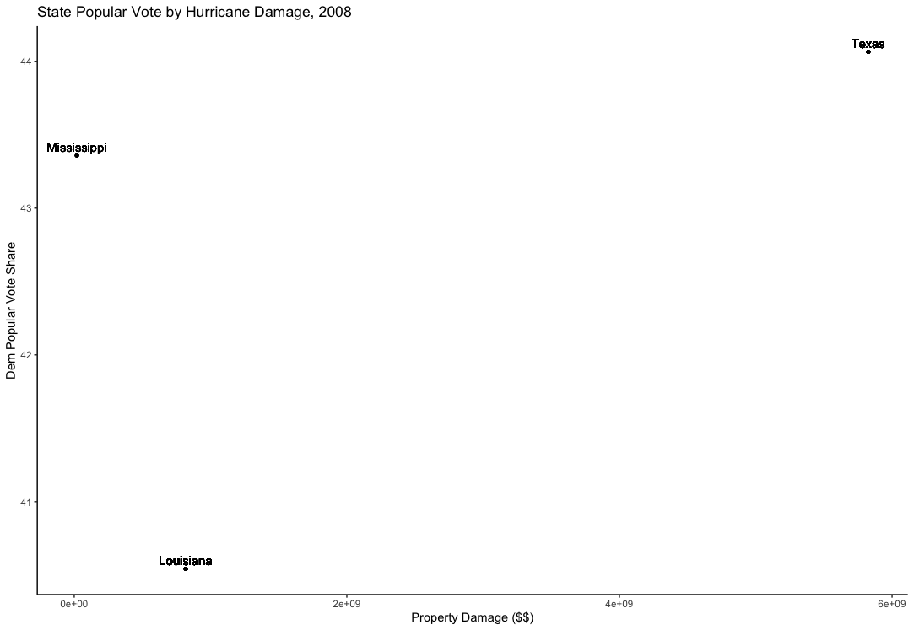
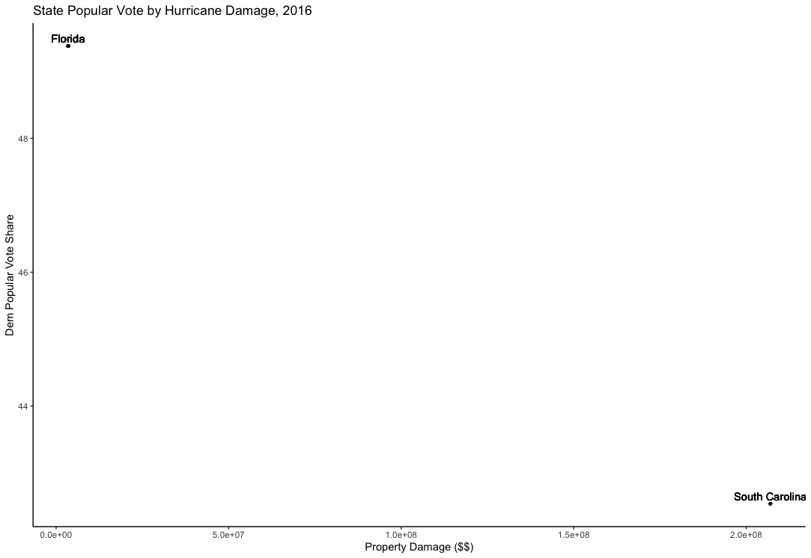

# Introduction
Welcome back to the ring. Our contestants are currently toe to toe and it is unclear who’ll get to scream ADRIANNNNN at the end of the fight. 

This week, we’ll take a brief look at “shocks,” the unpredictable and unpolitical events that occur during elections. These include natural disasters, large sporting events, and even things like lottery wins. 

## Hurricanes

Specifically, I took a look at hurricane data and how they might correlate with state votes. Using NOAA data on past hurricanes, I analyzed total damage property per state for specific years against how those states voted in that year’s presidential election. 

The hurricane data is pretty bad. A lot of information is missing, particularly on states that I would have hoped would carry data like New York or New Jersey during Hurricane Sandy. First, I filtered by presidential year and merged our dataset with the state popular votes. Then, there was a matter of converting the NOAA property damage labeling system (i.e. affixing “M” or “B” to the ends of numbers). Finally, because some states took multiple damage losses throughout a time frame, I wrote some code to sum up the total property damage in dollars. 

We see that in 2008, Louisiana took a total property damage loss of \$818,607,500 and voted 40.54% to Democrats. Mississippi took a total property loss of \$19,390,000 and voted 43.36% to Democrats. Texas was \$5,825,100,000 and 44.06% respectively. This was Obama’s bid for presidency. There is clearly very little correlation between the two variables. 

Things are a little more clear cut in 2016, but there are only two datapoints that had non-NA entries. 

Then, I looked at that same dependent variable but with total damage property across the entire presidential term on incumbent years, specifically 2012. 

The only two states with non-zero data on hurricanes was North Carolina and Louisiana, at \$97,000,000 and \$117,340,500 respectively. The two differ in around 8 percentage points, with a negative correlation (as property damage increased, there was less votes for Democrats). In 2008, however, Obama got 50.17% of the two party popular vote share in North Carolina and 40.54% in Louisiana. So while North Carolina’s vote share went down slightly in 2012 after hurricane property damage, Louisiana’s vote share actually slightly increased. This could be due to an increase in federal aid during that time. 

Ultimately there was not enough data for me to draw conclusions, other than that shockingly, there are no real correlations between hurricanes and two party vote share. 

## Hurricane Helene and 2024

My instinct was to say that we should absolutely be focusing on Hurricane Helene, but I amend that thought after analyzing the (few) data points that we received from the NOAA. It looks like although hurricanes are indeed “shocks,” they are the expected unexpected. What I mean by that is– there are ALWAYS hurricanes and twisters happening. Voters have come to expect those natural disasters. 

Additionally, there is a question of partisan bias. From my data analysis, I draw the conclusion that it seems like voters will continue to vote for whichever party they identify with, ESPECIALLY if in the face of an emergency. Why would they switch over and take a risk when they are in the most risk-vulnerable state of being possible? If I were a voter who just lost my house to a hurricane, I likely am not going to cast a risky vote. I’m staying in my comfort zone. That might be some political psychology mumbo-jumbo, but as I move into cementing my forecasting model, I am sticking to my guns on this one. 

## Forecasting Model

I am returning to the model that I had which is a combination of voter turnout, party ID, and RDI. 

Using a voter turnout simulation (see Week 7: The Ground Game[^1]), I will land on a final prediction of the voting-eligible population that turns out in 2024 in each state. This simulation will incorporate people’s party IDs. 

Then, using this simulation, I will use a weighted ensemble model using party IDs and fundamentals to predict state popular-vote shares (and extrapolate to be electoral college votes). 

[^1]: https://carolinechoi.github.io/election-blog/post/2024/10/21/week-7-the-ground-game/ 

