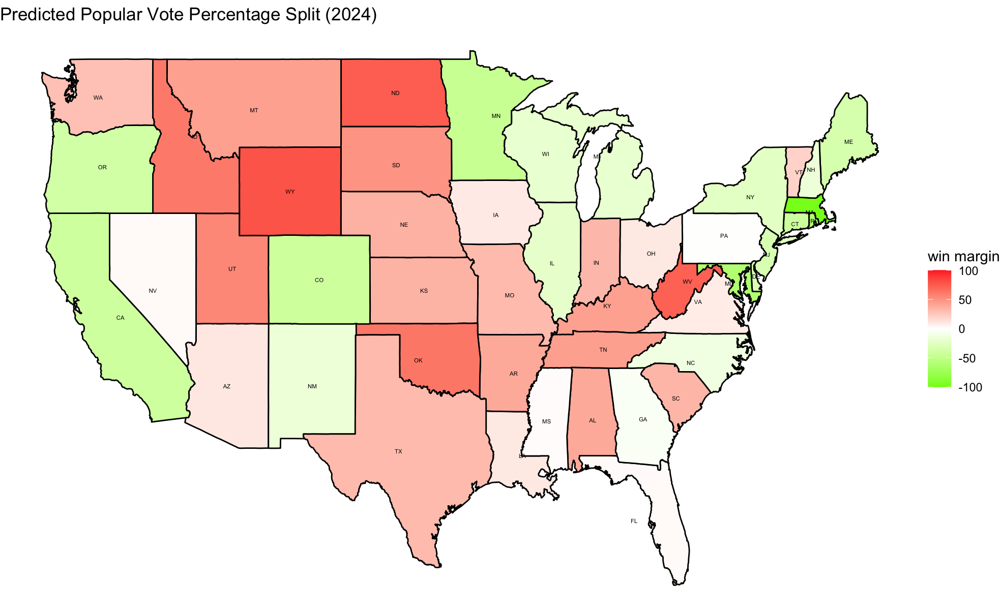
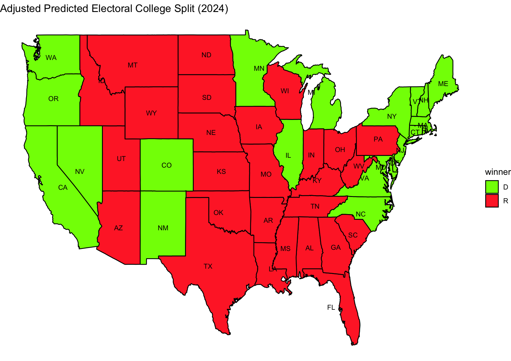

# Introduction

It’s finally here. The thing we’ve been waiting for. It’s not Rihanna’s next album or an end to my seasonal depression– it’s the presidential election. Yay!

Throughout this semester, my goal has been not only to be able to forecast the democratic 2pvp for each state, but also the popular vote share for each swing state (Arizona, Georgia, Michigan, Nevada, North Carolina, Pennsylvania, Wisconsin). 

I considered making you wait for the results that I predicted until the very end of this blog post, but it’s already a nerve-wracking week. So without further ado, my national forecasting model predicted that Harris will win at 51.23% of the popular vote. That being said, my state-level electoral college model predicted a Trump win, with him taking four of the swing states. My very conservative model is therefore predicting a 2016 level election (where Clinton took the popular vote, but lost the electoral college). For once, I hope that my math is wrong. 

## National Vote-Share Model

This model uses a fundamentals-only approach to predicting the Democratic popular vote share. Assuming that this election is about as wacky as the past elections have been, I figured that the most useful constant in analyzing election outcomes is, indeed, economics. Specifically, assuming that voters are myopic – ESPECIALLY independent and undecided voters – I filtered the dataset down the second quarter GDP entries. I make this distinction because, again, voters may not be paying particular close attention to the election until the past few months and their outlook on the current presidency (where Harris is technically part of the incumbent administration) could be swayed by their perception of how the economy is. Over the past term, we’ve seen a lot of inflation and complaints over student debt and rising gas prices, but if the last quarter’s GDP growth was good, I think we can expect to see a better outcome for the Democratic party. 

Using the FRED dataset, we take GDP quarterly growth and GDP, as well as vote lag to train our machine learning model. Then, we’ll use elastic-net, which allows us to deal with multicollinearity and generalize on much unseen data. Predicting the 2024 national 2-party vote share returns us: 51.234% to Harris. 

We can use in-sample predictions to calculate error for our fundamental model. The Mean Absolute Error (MAE) is 3.988479, with a Mean Squared Error (MSE) of 23.90447 and a Root Mean Squared Error (RMSE) of 4.88922. This MAE is not the most ideal given the neck-to-neck nature of this election. Being wrong by 3.9% could be huge. That being said, just from pure gut feeling, it feels correct. Models like FiveThirtyEight tend to have MAEs around 2-3 points, so I’m not too far off. In terms of the MSE, I do feel pretty uneasy. It does indicate outliers in the model predictions or perhaps issues with certain years that aren’t captured perfectly. I assume it comes from the fact that I don’t have perfect data for every GDP growth. This makes sense given that the RMSE is around 4.9. I feel like this comes from lack of clean GDP growth data. 

## State-level Model

On top of running a fundamental only machine learning model, I used a binomial simulation model to analyze voter turnout using party ID. 

This was a fairly complicated process, so stick with me! 

First, I took Statara’s voter files for each state and wrote some code to scrape together the percentage of Democrat-registered voters in their 1% voter population sample. Keep in mind that under Statara’s files, they made a new column containing their predicted party ID for registered voters. This is what I used for data, but it could have introduced even more human error. Also, the percentage that I used for voters here was based on two-party split, which means I removed all unaffiliated/independent voters and counted up the percentage of Democratic voters based on total Democrats and Republicans. (Note: I used ChatGPT to help automate this process, given that I was trawling through 50-some voter files.)

Next, I used a binomial simulation, where turnout probability was estimated based on historical turnout rates. This came from the state turnout file, which gives us the total voter eligible population and the number of ballots that were turned in. Taking the data available from 2002 to 2020, I calculated average VEP turnout for each election and state and used it to create a single average turnout probability that could be applied to each state. Then, this was used to simulate a voter turnout percentage for each state. 

Finally, taking the Democratic voter percentage for each state, I multiplied that by the voter turnout percentage. This gives us the expected output of Democratic turnout (or votes towards the Democratic party). THEN, I multiplied everything by a factor of two to readjust to historic turnout levels. Simple, but pretty effective when compared to historic data. 

That being said, I did have some errors that I needed to account for. Check out this win margins map that I generated. There are a few states (non swing states) that are just wrong. For example, the last time Washington was 1984. The same goes for states like Vermont. 

Ultimately, this model couldn’t be applied to all states! I chose only to apply it to swing states since we can mostly ignore the other states and assume that they will continue to vote how they always have voted. See below:

The in-sample error was as follows: a MAE of 0.0828, MSE of 0.00936 and a RMSE of 0.097. It’s not shabby but it could be lower. The MSE is quite promising, however, and incredibly low given the assumptions I had to make with this model. Again, I think the error probably comes from incomplete data. For example, having access to more voter information would have been ideal, so I could actually run the voter turnout simulation with Democratic voter turnout already incorporated into the dataset. 

All in all, this probabilistic model returns that Trump will take Arizona with 54.41% of the two party popular vote, Georgia with 50.83%, Pennsylvania with 52.44% and Wisconsin with 53.23%. Harris will take Michigan with 51.15%, Nevada with 50.33%, and North Carolina with 51.51%. In total, given that no other states swing, Trump will win the electoral college with 275 votes and Harris will lose with 262. 
