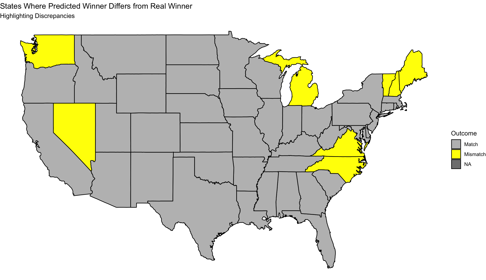
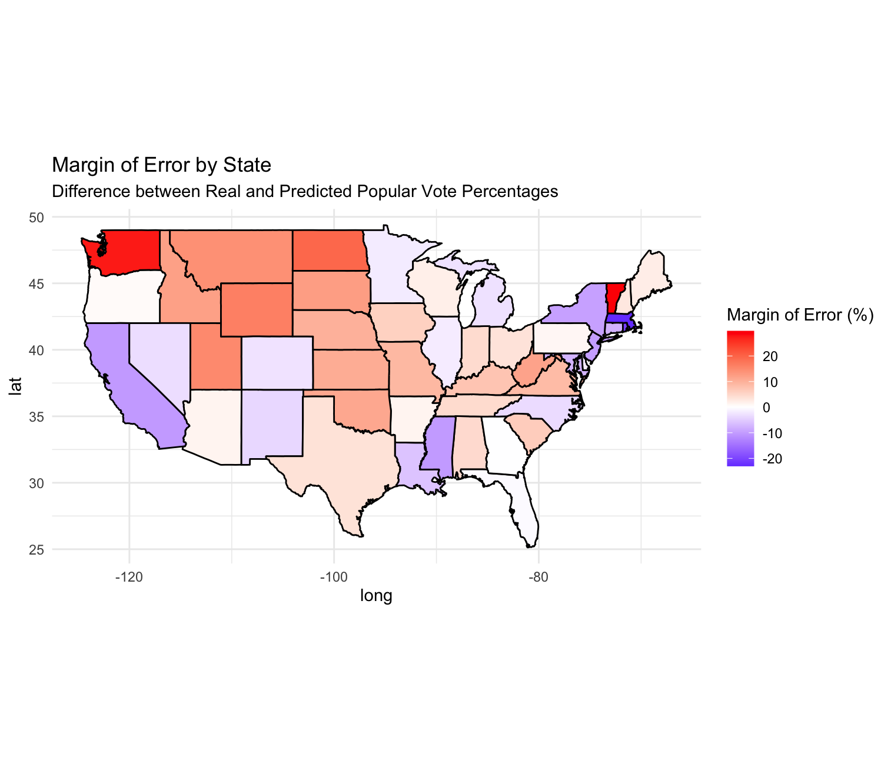

# Introduction

Hi! I just got back from a very relaxing month-long vacation off the grid in the Catskills. It was hard to leave my phone and laptop behind at home, but it was certainly harder to dismantle the cell towers and wifi systems in the AirBnb. Apparently every time you try to go “off the grid,” AT&T sends its best warriors to dissuade you. Anyways, what happened with the election? Did Harris give her victory speech yet?

Oops. Just kidding. That’s in some alternate universe where I have the means to afford a Catskills cabin and have graduated on time with my original class of ‘24. Also one where America voted for Harris and not Trump. Laugh Out Loud!

As my last blog post discussed, my final prediction model for the electoral college was based around using binomial simulations to estimate voter turnout based on party identification. I analyzed the voter files from Statara to determine the proportion of Democratic voters in each state and applied historical turnout rates to simulate expected voter participation. This led me to predict that Trump would win the electoral college with 275 votes and that Harris would lose with 262. This, apparently, was still an optimistic prediction based on the REAL results – Trump winning with 312 electoral college votes and Harris losing with 226. 

Additionally, my final national popular vote model was forecasted using solely economic fundamentals, particularly second-quarter GDP growth, under the assumption that voters are influenced by the most recent economic performance. This was executed using an elastic-net regression model, accounting for multicollinearity and aiming to generalize predictions across various data sets. This predicted (incorrectly, again) that Harris would secure 51.23% of the popular vote. In reality, Harris proceeded to take 48.3% of the popular vote[^1]. 

In summary, I predicted accurately that Trump would win the election, but the most error emerged from the difference in electoral college votes, as well as the fact that my national popular vote model wrongly predicted the winner. 

## Accuracy Analysis

When I created my models, I measured the following error. For the national popular vote model, the mean absolute error was 3.988479, with a mean squared error of 23.90447 and a root mean squared error of 4.88922. Technically, I could use the MAE to account for the difference in the popular vote, which was 2.93%. That’s well within the MAE. 

For the electoral college model, the MAE was 0.0828, MSE was 0.0096 and RMSE was 0.097. The MSE was indeed promising, given the assumptions that I made to create this model. 

The states that I predicted incorrectly were North Carolina, Michigan, and Nevada, namely the three swing states that I attributed to Harris. Ultimately, Trump took all seven swing states, not just the four that I predicted. 

While I was building my model, I noticed that it predicted non-swing states MOSTLY accurately. A few non-swing states were just wrong, like Washington and Vermont. 

See this map where the original predicted winner differed from the actual winners (including swing states). Notice, specifically, the few non-swing states that my model incorrectly predicted against historical trends. 

Because of this, I focused my model around only the swing states. However, I will be including the data from these blatantly incorrect non-swing states in order to understand the error in my code analysis.

Here is a map of the margins of error that I carried on this electoral college model. For each state, it demonstrates the difference between the predicted and actual state popular vote percentage. 

There are a few outliers here – California, Massachusetts, and Washington. Again, of these, only Washington was predicted incorrectly. 

## Hypothesis For Error

My electoral college model ignored undecided voters – to keep things simple, I chose to calculate voter percentage based on a two-party split. This might have been stupid given that swing states depend on undecided voters. However, my reasoning at the time was that Statara had a new column containing their predicted party ID for registered voters and that the undecided voters would be accounted for in that. This created an extra layer of potential error. 

Specifically, for the swing states that I got wrong (North Carolina, Michigan, Nevada), the margin of error was 3.71, 2.85, and 3.33% respectively. This feels wide to me, considering the MAE for the model. Upon reflection, the reason that I had blatant error in predicting the popular vote share for Vermont, Virginia, Washington, and New Hampshire may have derived from excluding independent voters. I mean, Vermont is home to THE Bernie Sanders, the longest-serving independent in U.S. congressional history. As for New Hampshire, it did used to be a battleground state, although it has voted Democratic in all but one election since 1992[^2].

## Proposed Quantitative Tests And Proposed Changes

I’d love to use more data from voter files for the states that I predicted incorrectly and incorporate the independent voters to see if there is any difference that is predicted in turnout. I also would test how often these swing states have flipped and see if that affected the probability of our historical turnout factor. 

For the next election, should I still be interested in politics and still have access to Statara’s top-secret voter files, I will be improving my electoral college model by creating a likelihood factor of a voter turning out to vote (based on their historical voting patterns). Additionally, I would focus on independent voters and categorizing their likelihood of voting Democrat or Republican. This would all funnel into my voter turnout simulations. 

As for the national popular vote model, I would improve it by including a factor for incumbency. A lot of voters – feeling fed up with how the economy went under the Biden administration – voted for “change,” which is to say that incumbency gave Harris the disadvantage. I think this is demonstrated clearly in how both the House and the Senate turned red this election. Americans are showing us their dissatisfaction with the last administration under the Democratic party. 

After meeting with the goat, Elliott Morris, and having discussed my skepticism about the usefulness of data in politics, I have realized that there will always be areas for improvement and that studying and building forecasting models is an incomplete and unfinished business. This is very cool and reminds me a bit of a reading I did for class on “unfinished” art[^3]. 

[^1]: https://apnews.com/projects/election-results-2024/?office=P 
[^2]: https://www.270towin.com/states/New_Hampshire 
[^3]: https://direct.mit.edu/afar/article-abstract/43/1/60/54580/Ephemerality-and-the-Unfinished-in-Vodun?redirectedFrom=fulltext 

